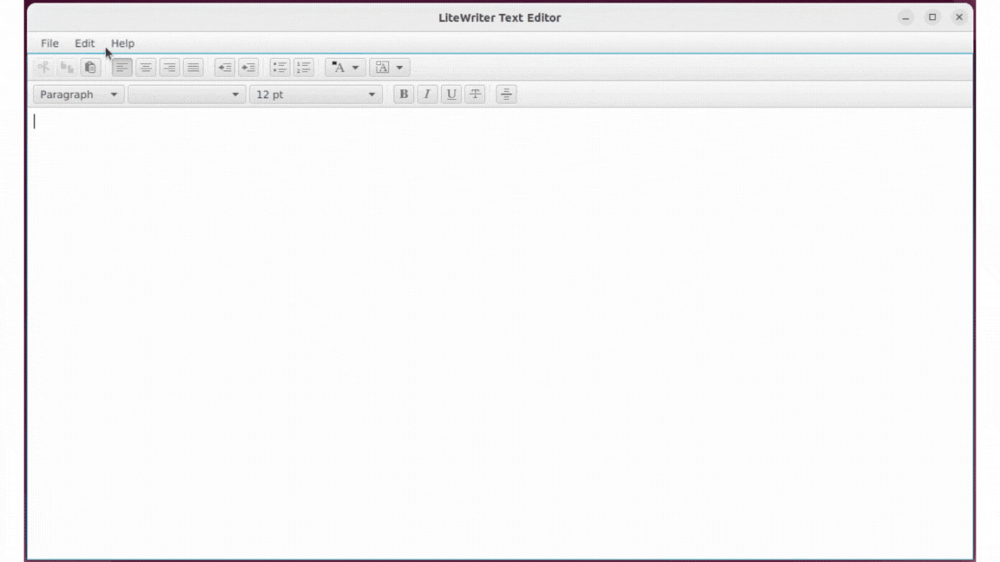

# LiteWriter Text Editor

LiteWriter is a simple and user-friendly text editor application built using JavaFX. This text editor allows users to create, open, edit and save plain text documents with a variety of formatting options. It includes essential file and edit menu functionalities as well as a rich toolbar for text formatting.

## Features

### Menu Bar
The text editor includes the following menus and menu items with shortcuts:
- **File**
  - `New` (Ctrl + N): Create a new document.
  - `Open` (Ctrl + O): Open an existing document.
  - `Save` (Ctrl + S): Save the current document.
  - `Save As` (Ctrl + Shift + S): Save the document with a new name.
  - `Print` (Ctrl + P): Print the document.
  - `Close Window` (Ctrl + W): Close the editor.

- **Edit**
  - `Undo` (Ctrl + Z): Revert the last action.
  - `Redo` (Ctrl + Y): Re-apply the last undone action.
  - `Cut` (Ctrl + X): Cut the selected text.
  - `Copy` (Ctrl + C): Copy the selected text.
  - `Paste` (Ctrl + V): Paste the copied/cut text.
  - `Find And Replace` (Ctrl + H): Search for specified text and replace it with another value (one by one / at once).
  - `Select All` (Ctrl + A): Select all text in the document.

- **Help**
  - `About` (F1): Displays information about the application.

### Text Formatting Toolbar
The toolbar allows users to apply various formatting options to the text, including:
- **Font Family**: Change the font of the selected text.
- **Font Size**: Adjust the size of the text.
- **Foreground Color**: Change the text color.
- **Background Color**: Change the background color of the text.
- **Indentation**: Increase or decrease indentation.
- **Text Alignment**: Align the text (left, right, center, justify).
- **Bulleting**: Add bullet points or numbers.
- **Formatting**: Paragraph, Heading 1, Heading 2, ..., Heading 6
- **Text Styling**: Bold, Italic, Underline, Strikethrough
- **Insert Horizontal Line**: Add a horizontal line to separate content.
- **Cut, Copy, Paste**: Standard clipboard operations.

### Other Features
- **Scrollable Text Area**: The text area supports scrolling for longer documents.
- **Drag-and-Drop Support**: Drag and drop text files directly onto the editor to load and display the file content.
## Installation
1. Clone the repository:
    ```bash
    git clone https://github.com/your-username/text-editor-app.git
    ```
2. Import the project into your favorite Java IDE (e.g., IntelliJ IDEA, Eclipse).
3. Make sure you have JavaFX and JDK 11 or higher installed.
4. Run the project using Maven:
    ```bash
    mvn clean javafx:run
    ```

## Application Preview
- SplashScreen

<br><br>
- menu bar

<br><br>
- "About" menu item

<br><br>
- Text formatting & scrollable text area

- Find and replace

  
## Version
v1.0.0

## License
This project is licensed under the **MIT License**. See the [LICENSE](LICENSE) file for details.<br>
CopyRight &copy; 2022 MBPT. All Rights Reserved.
